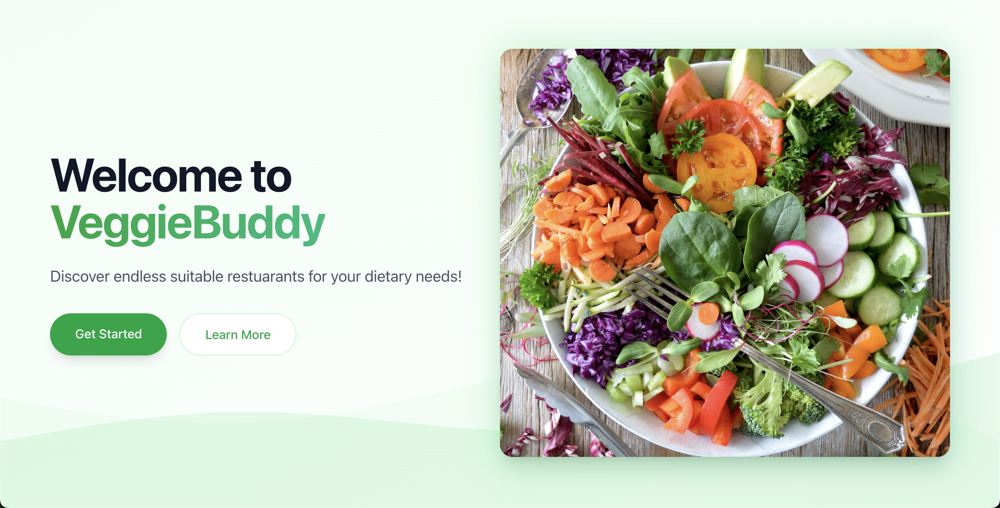
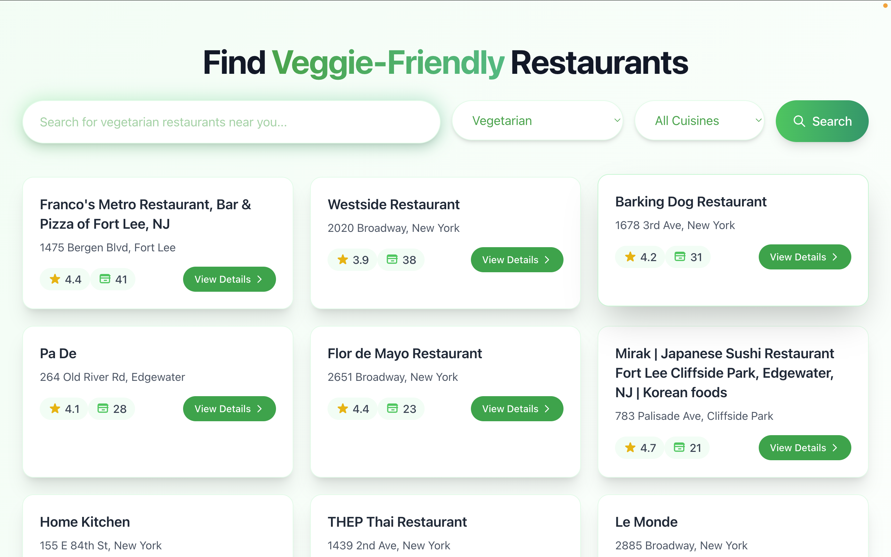
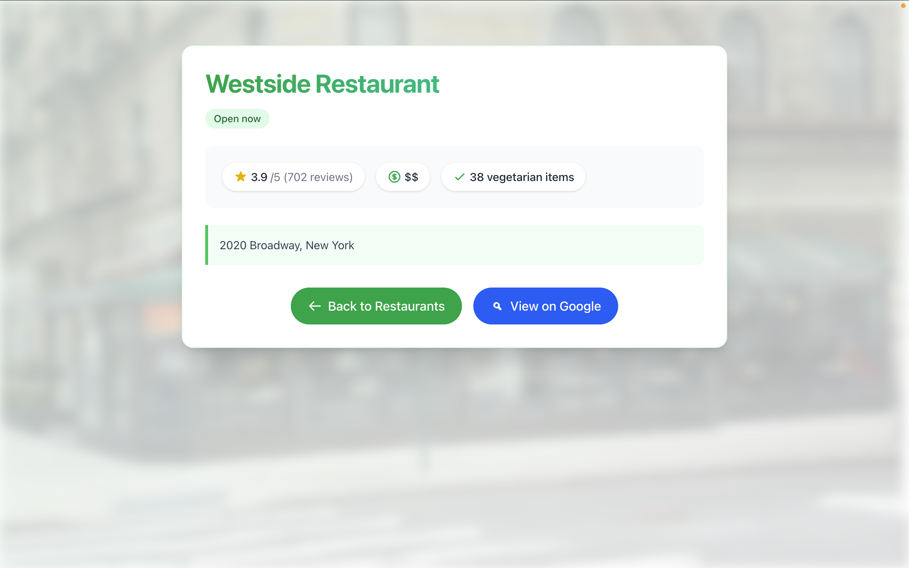

<div align="center">
  <h1>VeggieBuddy 🥗</h1>
  
  <p>Discover diet-friendly restaurants with ease</p>

  <p>
    <a href="https://mit-license.org/" target="_blank">
      
    </a>
    
    
  </p>
</div>

## 📋 Overview

VeggieBuddy is a web application that helps you discover the best food-friendly restaurants near you. With smart recommendations based on your preferences, it makes finding meals meals based on your preference easy and stress-free. VeggieBuddy connects you to spots you'll love.

## 🖼️ Screenshots

<div align="center">
  
  
  
</div>

## 🔧 Technologies

- **Frontend**: HTML, CSS, TypeScript, React
- **Backend**: Python, Flask
- **APIs**: Google Maps Places API

## 🚀 Getting Started

### Prerequisites

- Python 3.8+
- pip
- Node.js and npm (for frontend)

### Installation

1. Clone the repository:

```sh
git clone https://github.com/ved-patel226/veggiebuddy.git
cd veggiebuddy
```

2. Install backend dependencies:

```sh

pip install -r backend/requirements.txt
```

3. Install frontend dependencies:

```sh
cd frontend
npm i
```

4. Set up environment variables:

```sh
cd ../
cp .env.example .env
# Edit .env with your API keys and database credentials
```

## 🔍 Usage

1. Start the backend server:

```sh
python backend/main.py
```

2. In a separate terminal, start the frontend:

```sh
cd frontend
npm run dev
```

3. Navigate to `http://localhost:5173/` in your browser

## 📚 API Documentation

The VeggieBuddy API is available at `http://127.0.0.1:5000/api`

| Endpoint                      | Method | Description                                       |
| ----------------------------- | ------ | ------------------------------------------------- |
| `/restaurants?q=&preference=` | GET    | Get restaurants with search and preference filter |
| `/restaurant?placeid=`        | GET    | Get restauraunt information via placeid           |
| `/available-cuisines`         | GET    | Get a list of all available cuisines              |
| `/cuisine-to-restaurants`     | GET    | Map each cuisine to its corresponding restaurants |

## 🤝 Contributing

Contributions are welcome! Please feel free to submit a Pull Request.

1. Fork the repository
2. Create your feature branch (`git checkout -b feature/amazing-feature`)
3. Commit your changes (`git commit -m 'Add some amazing feature'`)
4. Push to the branch (`git push origin feature/amazing-feature`)
5. Open a Pull Request

See the [contributing guide](CONTRIBUTING.md) for detailed instructions.

## 👨‍💻 Authors

- [@ved-patel226](https://github.com/ved-patel226)
- [@Vedant-Daga-Codes](https://github.com/Vedant-Daga-Codes)

## 📝 License

Copyright © 2025 [Ved Patel & Vedant Daga](https://github.com/ved-patel226).<br />
This project is [MIT](https://mit-license.org/) licensed.
